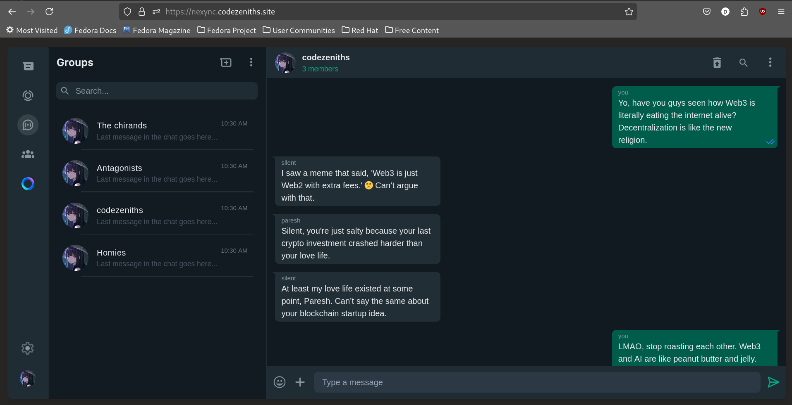
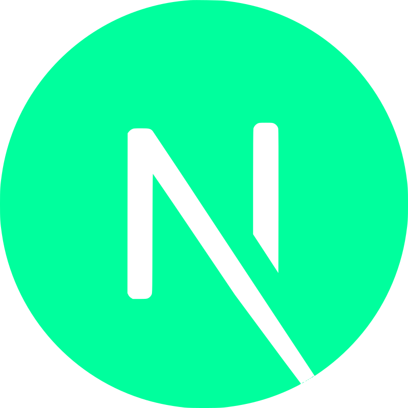
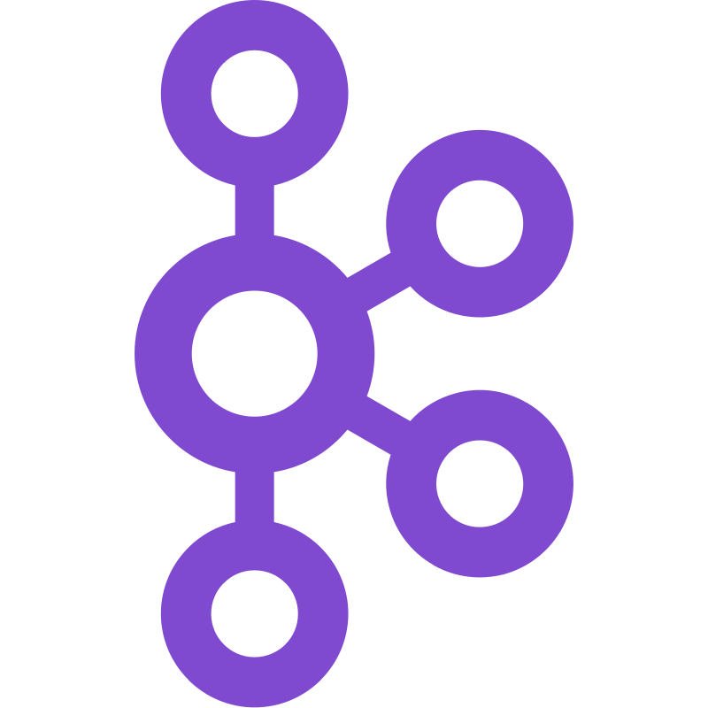
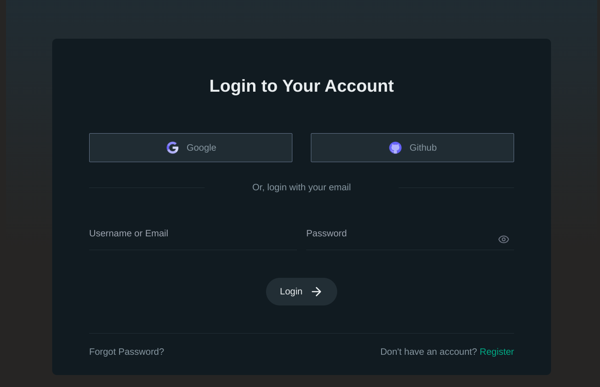

# Nexync 🌐  
**"Where connections spark, and conversations flow. Scalable, seamless, and always in sync!"**

Nexync is a scalable and feature-rich chat application designed to serve millions of users concurrently with high performance and reliability. Built with a modern tech stack, it delivers seamless communication and real-time features that empower users to connect effectively.

---

<div style="background-color: black; padding: 10px; text-align: center;">
  
</div>

## 🚀 Introduction

Nexync combines cutting-edge technologies to provide a robust and reliable communication platform.  
### Key Highlights:
- **Frontend:** Developed with **Next.js** for responsive, interactive user experiences.
- **Backend:** Powered by **Node.js** with a **microservices architecture** for modularity and scalability.
- **Real-Time Communication:** Utilizes **WebSockets** and **Redis Pub/Sub** for instant message delivery.
- **Messaging Queue:** Implements **Kafka** and **RabbitMQ** for efficient and high-throughput task handling.
- **Type Safety:** Fully written in **TypeScript** with **Zod** for runtime validation.

---

## 🛠️ Key Features

### {:style="width: 50px; height: 50px;"} Frontend: **Next.js**
- Delivers a highly responsive and dynamic interface with features like lazy loading and infinite scroll.

### {:style="width: 50px; height: 50px;"} Backend: **Node.js**
- Utilizes a microservices architecture to ensure modularity and high scalability.

### {:style="width: 50px; height: 50px;"} Real-Time Messaging: **WebSockets & Redis**
- Ensures low-latency communication with **Socket.IO** and scalable message delivery using **Redis Pub/Sub**.

### {:style="width: 50px; height: 50px;"} Message Queuing: **Kafka**
- Processes messages in **Kafka chat-topic** (8 partitions) and efficiently stores them in **PostgreSQL** using bulk insertion every 5 seconds.

### {:style="width: 50px; height: 50px;"} Caching & Scalability: **Redis**
- Implements API response caching to minimize latency and supports horizontal scaling for real-time features.

### {:style="width: 50px; height: 50px;"} Task Management: **RabbitMQ**
- Handles secondary tasks like email notifications and OTP verification via task-specific queues.

### {:style="width: 50px; height: 50px;"} Authentication
- Cookie-based **JWT authentication** ensures secure session management.
- **Google** and **GitHub** login via **Passport.js** provide seamless OAuth integration.

### {:style="width: 50px; height: 50px;"} Push Notifications: **Firebase FCM**
- Real-time push notifications for instant user updates across devices.

### {:style="width: 50px; height: 50px;"} Database: **PostgreSQL & Prisma**
- Relational database with efficient data handling using **Prisma ORM**.

### {:style="width: 50px; height: 50px;"} Robust Typing: **TypeScript & Zod**
- Ensures type safety and secure data handling via strict runtime validations.

### {:style="width: 50px; height: 50px;"} Performance Optimizations
- Features include debouncing, throttling, pagination, and suspense boundaries for enhanced performance.

---

## 🏗️ Architecture

### 1️⃣ Chat System Architecture  
Efficiently handles millions of concurrent users with real-time communication powered by **WebSockets**, **Kafka**, and **Redis Pub/Sub**.  

<div style="background-color: black; padding: 10px; text-align: center;">
  
</div>

#### Workflow:
1. **Message Flow:**
   - WebSocket servers receive messages from users.
   - Messages are simultaneously:
     - Published to **Kafka chat-topic** for processing and queuing in **Redis**.
     - Published to **Redis Pub/Sub** for instant delivery to recipients.
   - Bulk-inserted into **PostgreSQL** every 5 seconds for optimal performance.

2. **Load Balancing:**  
   - **Nginx reverse proxy** balances WebSocket connections across multiple servers.

---

### 2️⃣ Queuing System Architecture  
Handles secondary tasks such as email notifications and OTP verification using **RabbitMQ**.  

<div style="background-color: black; padding: 10px; text-align: center;">
  
</div>

#### Workflow:
- Dedicated queues for specific tasks:
  - Reset Password Emails
  - Verification Code Emails
  - Welcome Notifications
- Messages are processed in a **FIFO** manner, ensuring task reliability and API performance.

---

## 📦 Setup & Installation

### Prerequisites
- **Node.js**
- **Docker**

### Installation Steps
1. Clone the repository:
   ```bash
   git clone https://github.com/s1lent-dev/nexync.git
   cd nexync

2. Start the application:
    ```bash
    docker-compose up
    Access the frontend at http://localhost:3000 and backend at http://localhost:5000.
    Note: For Google and GitHub authentication, generate credentials via Google Cloud Console and GitHub Developer Settings.

### 📖 Usage
### 1️⃣ Registration

<div style="background-color: black; padding: 10px; text-align: center;">
  
</div>

#### A. Manual Registration:
- Create an account using your email and password.
- Verify your email using a unique verification code.
  - **Note**: If the verification code is not visible in your inbox, check your spam/junk folder. Emails will be sent from **deshpande.pxresh@gmail.com**.

#### B. OAuth Registration:
- Register via Google or GitHub.
- Credentials are autogenerated and emailed for convenience.
  - **Note**: If the email containing your autogenerated password is not visible, check your spam/junk folder. Emails will be sent from **deshpande.pxresh@gmail.com**.

<div style="background-color: black; padding: 10px; text-align: center;">
  
</div>

### 2️⃣ Login

#### A. Manual Login:
- Use your email and password.

#### B. OAuth Login:
- Authenticate via Google or GitHub.

### 3️⃣ Features
- **Private Chats**: Chat directly with your connections.
- **Group Chats**: Create or join groups; manage members if you're an admin.
- **Connections**: Follow users, accept/reject connection requests, and explore profiles.
- **Settings**: Update profile picture, username, and bio.

---

### 🤝 Contributions
Contributions are welcome! Feel free to fork the repository and submit pull requests for improvements.

---

### 📝 License
This project is licensed under the MIT License.

---

### 📧 Contact
For queries or feedback, reach out via email: **deshpande.pxresh@gmail.com**


